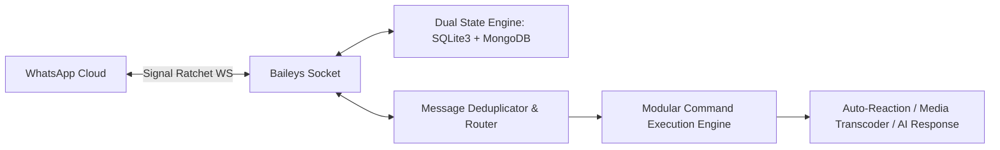

# 🤖 Welcome to the PGWIZ-MD Official Wiki

Welcome to the comprehensive technical documentation for **PGWIZ-MD** and **PGWIZ-MD Light (Litrop)**.

---

## 🧭 Quick Navigation

| Section | Description | Link |
| :--- | :--- | :--- |
| 🚀 **Getting Started** | 1-Click Cloud & VPS Deployment Guide | [[Deployment]] |
| ⚙️ **Configuration** | Environment variables, MongoDB & SQLite dual-store | [[Configuration]] |
| 📖 **Command Catalog** | Complete list of all 242+ commands across 18 categories | [[Commands]] |
| 🛡️ **Group Moderation** | Admin tools, warning system, auto-clear scheduler | [[Admin-Commands]] |
| ⚡ **24/7 Automation** | Always Online, Auto Status Viewer, Auto Read & React | [[Automation]] |
| 📥 **Media Downloaders**| YouTube, TikTok, Facebook, Instagram media scrapers | [[Downloaders]] |
| ❓ **FAQ & Troubleshooting** | Common issues, session reconnection, MongoDB help | [[FAQ]] |

---

## 🏗️ Core Architecture

---

## 🌐 Live Web Tools
* **Interactive Web Wiki**: [https://session-s.pgwiz.cloud/wiki](https://session-s.pgwiz.cloud/wiki)
* **Web Session Scanner**: [https://session-s.pgwiz.cloud](https://session-s.pgwiz.cloud)
* **Features Showroom**: [https://session-s.pgwiz.cloud/features](https://session-s.pgwiz.cloud/features)
